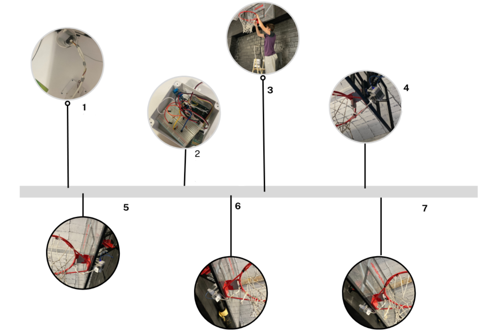
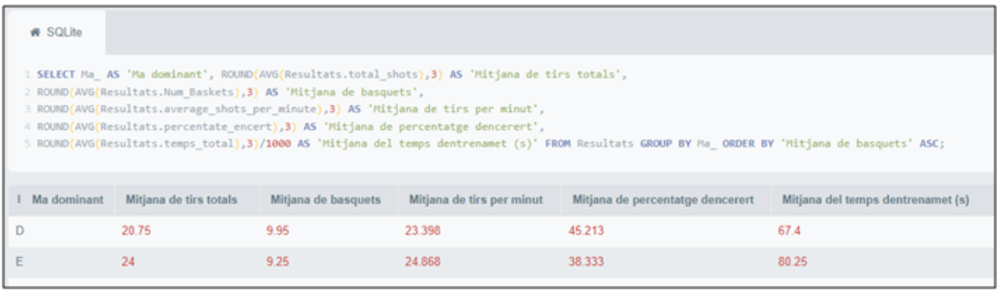
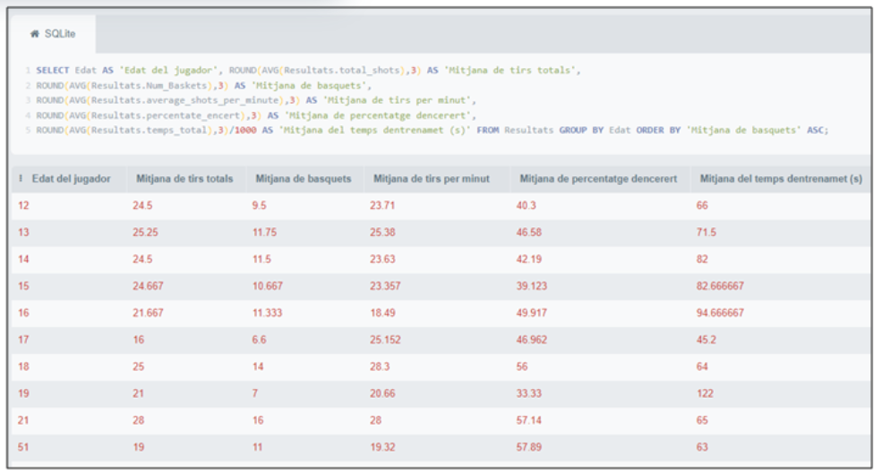
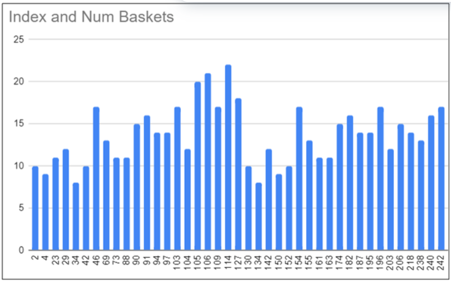
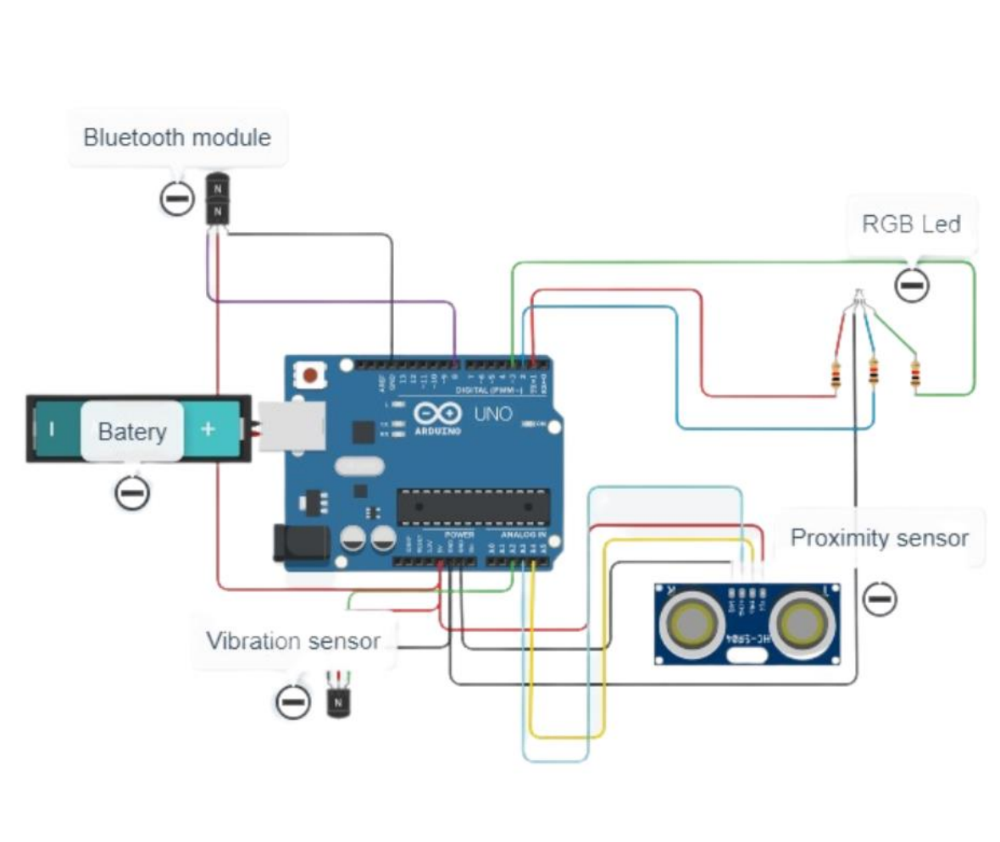

# BK-Shoot

### Real-time Basketball Shot Tracker with Sensor Fusion

A low-cost IoT device that detects basketball makes/misses in real time using IR + vibration sensor fusion, paired with an Android app for live statistics tracking.

[](#demo)
[](LICENSE)
[](recognition/AWARDS.md)

---

## Demo

https://github.com/user-attachments/assets/b2f04fc3-4c96-47cb-862c-22dc06aca971



---

## Recognition

| Award | Competition | Year |
|-------|-------------|------|
| **Honourable Mention** | 12th Planter de Sondeigs i Experiments (UPC, UAB, UB, Idescat) | 2021 |
| Presented | ICFO Young Photonics Congress | 2021 |

> *"Per unir l'estadistica, el Big Data, la intel·ligencia artificial i la programacio a l'esport..."*
> — Jury Citation (For combining statistics, Big Data, AI, and programming with sports)

**[View certificates and full details](recognition/AWARDS.md)**

---

## Tech Stack

| Layer | Technology |
|-------|------------|
| **Hardware** | Arduino Uno, IR Sensor (E18-D80NK), Vibration Sensor (SW-420), HC-05 Bluetooth |
| **Firmware** | C++ (Arduino), JSON serial protocol, sensor fusion algorithm |
| **Mobile App** | MIT App Inventor (Android), Bluetooth serial, SQLite storage |
| **Data Analysis** | SQL queries, statistical analysis by demographics |

---

## Architecture

```
┌─────────────────────────────────────────────────────────────────────┐
│                         BASKETBALL HOOP                             │
│  ┌──────────────┐    ┌──────────────┐    ┌──────────────┐           │
│  │  IR Sensor   │    │  Vibration   │    │   Arduino    │           │
│  │ (E18-D80NK)  │───▶│   Sensor     │───▶│     Uno     │           │
│  │              │    │  (SW-420)    │    │              │           │
│  └──────────────┘    └──────────────┘    └──────┬───────┘           │
│                                                  │                  │
│                           ┌──────────────────────┘                  │
│                           ▼                                         │
│                    ┌──────────────┐                                 │
│                    │   HC-05 BT   │                                 │
│                    │   Module     │                                 │
│                    └──────┬───────┘                                 │
└───────────────────────────│─────────────────────────────────────────┘
                            │ Bluetooth
                            ▼
┌─────────────────────────────────────────────────────────────────────┐
│                        ANDROID APP                                  │
│  ┌──────────────┐    ┌──────────────┐    ┌──────────────┐           │
│  │   Bluetooth  │───▶│  Statistics  │───▶│   SQLite    │           │
│  │   Receiver   │    │   Engine     │    │   Storage    │           │
│  └──────────────┘    └──────────────┘    └──────────────┘           │
│                           │                                         │
│                           ▼                                         │
│  ┌─────────────────────────────────────────────────────────────┐    │
│  │  Live Dashboard: Attempts | Makes | Misses | FG% | Timer    │    │
│  └─────────────────────────────────────────────────────────────┘    │
└─────────────────────────────────────────────────────────────────────┘
```

---

## How It Works

**Sensor Fusion Algorithm:**

The core innovation is combining two sensors to achieve accurate shot classification:

```
IR Trigger (ball passes rim) ──┐
                               ├──▶ Fusion Window (1000ms) ──▶ Classification
Vibration (rim impact) ────────┘
```

| Scenario | IR | Vibration | Result |
|----------|:--:|:---------:|:------:|
| Clean swish | ✓ | ✗ | **MAKE** |
| Off-rim make | ✓ | ✓ | **MAKE** |
| Rim-out miss | ✗ | ✓ | **MISS** |

**Output Format (JSON over Bluetooth):**
```json
{"type":"make","ts":1234567}
{"type":"miss","ts":1237890}
```

---

## Validation Results

Field-tested with **20+ participants** and **~2,000 shots**.

| Metric | Result |
|--------|--------|
| Detection Accuracy | ~95% |
| Mean FG% (players) | 78.2% |
| Throughput | 24.5 shots/min |
| Detection Latency | ~250ms |
| Battery Life | >3 hours |

### Data Analysis

Shot data was exported to SQLite and analyzed by demographic factors:

| Analysis by Dominant Hand | Analysis by Age Group | Baskets Distribution |
|:-------------------------:|:---------------------:|:--------------------:|
|  |  |  |

See [`/testing/`](testing/) for complete dataset and methodology.

---

## Quick Start

```bash
# 1. Clone the repository
git clone https://github.com/omorros/bk-shoot.git

# 2. Upload firmware to Arduino
#    Open /firmware/bk-shoot.ino in Arduino IDE and upload

# 3. Build the Android app
#    Import /mobile/bk-shoot.aia into MIT App Inventor

# 4. Pair Bluetooth (HC-05, PIN: 1234)

# 5. Start shooting!
```

**Pre-built APK:** [`/mobile/bk-shoot.apk`](mobile/bk-shoot.apk)

---

## Hardware



**Bill of Materials (~€25 total):**

| Component | Model | Purpose |
|-----------|-------|---------|
| Microcontroller | Arduino Uno | Main controller |
| IR Sensor | E18-D80NK | Ball detection |
| Vibration Sensor | SW-420 | Rim impact detection |
| Bluetooth | HC-05/HC-06 | Wireless communication |
| Feedback | RGB LED + Buzzer | Audio/visual feedback |
| Power | 5V USB Power Bank | Portable power |

See [`/hardware/bom.md`](hardware/bom.md) for complete BOM and [`/hardware/wiring-table.md`](hardware/wiring-table.md) for wiring details.

---

## Challenges & Learnings

Building this project taught me:

| Challenge | Solution | Learning |
|-----------|----------|----------|
| **False positives** from rim vibration without ball | Implemented sensor fusion with time windowing | Signal processing, debouncing |
| **Bluetooth reliability** issues | Added JSON framing and error handling | Serial protocols, data integrity |
| **IR interference** in sunlight | Tuned threshold and added shading | Sensor calibration, environmental factors |
| **Data persistence** in app | Implemented SQLite storage | Database design, SQL queries |
| **Statistical validation** | Collected data from 20+ users, analyzed demographics | Experimental design, data analysis |

**Technical skills developed:**
- Embedded C++ programming
- Sensor fusion algorithms
- Bluetooth serial communication
- Mobile app development
- SQL and data analysis
- Scientific methodology (hypothesis, experiment, analysis)

---

## Roadmap

### v2.0 (Planned)
- [ ] React Native app (cross-platform iOS + Android)
- [ ] ESP32 with BLE (replace HC-05)
- [ ] Cloud sync with Firebase
- [ ] Web dashboard for coaches

### v3.0 (Future)
- [ ] TinyML on-device shot classification
- [ ] Camera-based trajectory analysis
- [ ] Multi-hoop support for team training

---

## Project Structure

```
bk-shoot/
├── firmware/           # Arduino C++ code
│   └── bk-shoot.ino
├── mobile/             # MIT App Inventor project
│   ├── bk-shoot.aia    # Source
│   └── bk-shoot.apk    # Pre-built APK
├── hardware/           # Schematics and BOM
│   ├── circuit_image.png
│   ├── bom.md
│   └── wiring-table.md
├── testing/            # Validation data and analysis
│   ├── 02_testing_video.mp4
│   └── *.png           # Analysis graphs
├── docs/               # Technical documentation
│   ├── tech-note.md
│   └── *.pdf           # Scientific poster & abstract
├── recognition/        # Awards and certificates
│   ├── AWARDS.md
│   └── *.pdf
└── README.md
```

---

## Documentation

| Document | Description |
|----------|-------------|
| [Technical Note](docs/tech-note.md) | Methodology, results, and discussion |
| [Scientific Poster](docs/bk-shoot_scientific_poster.pdf) | ICFO presentation poster |
| [Abstract](docs/ICFO_bk-shoot_abstract_english.pdf) | Scientific abstract (English) |
| [Awards](recognition/AWARDS.md) | Competition recognition details |

---

## About

**Author:** Oriol Moros Vilaseca

This project was developed as a secondary school research project (*Treball de Recerca*) at age 15, combining my interests in basketball, electronics, and programming. It demonstrates end-to-end product development: from problem identification through hardware design, firmware development, mobile app creation, and statistical validation.

---

## License

MIT License — see [LICENSE](LICENSE)

---

## Citation

If you use this project in research or teaching:

```bibtex
@software{bkshoot2021,
  author = {Moros Vilaseca, Oriol},
  title = {BK-Shoot: Arduino + MIT App Inventor Basketball Shot Tracker},
  year = {2021},
  url = {https://github.com/omorros/bk-shoot}
}
```

See [`CITATION.cff`](CITATION.cff) for full citation information.
