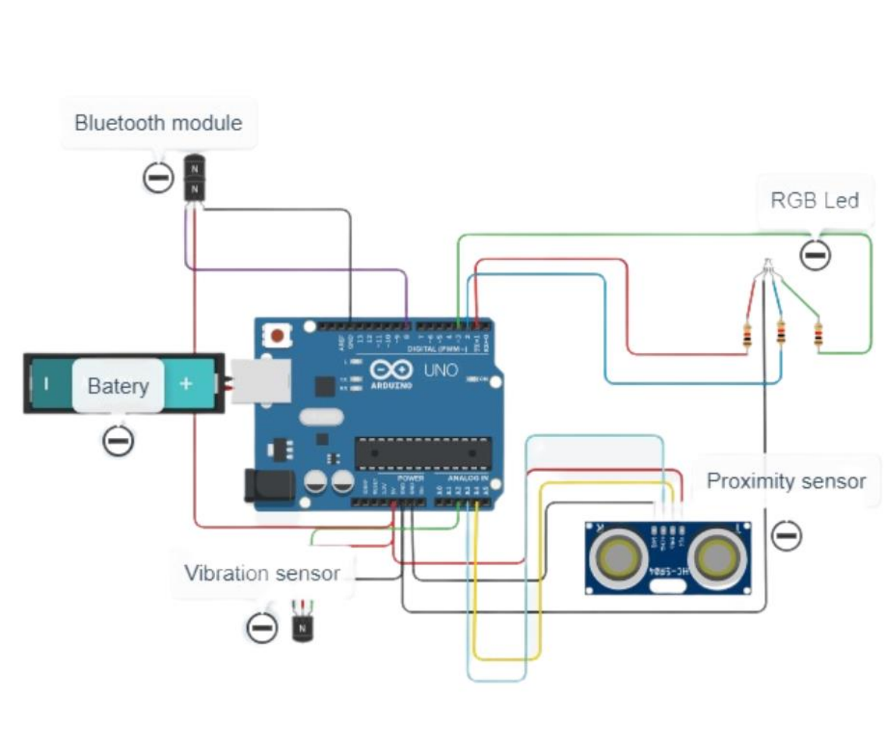

# Wiring Table

| Function | Sensor/Module Pin | Arduino Pin | Notes |
|-----------|-------------------|-------------|-------|
| IR sensor | OUT | D2 | Detects ball crossing |
| Vibration sensor | DO | D3 | Detects rim impact |
| RGB LED Red | R | D9 | 220 Ω resistor |
| RGB LED Green | G | D10 | 220 Ω resistor |
| RGB LED Blue | B | D11 | 220 Ω resistor |
| Buzzer | + | D6 | Passive buzzer |
| HC-05 TX | TXD | D0 | Arduino RX |
| HC-05 RX | RXD (via divider) | D1 | Arduino TX (5 V→3.3 V divider) |
| +5 V | VCC | 5 V | Power |
| GND | GND | GND | Common ground |

---

## Circuit diagram

Full circuit showing Arduino Uno connected to Bluetooth, IR sensor, vibration sensor, RGB LED, buzzer, and power bank.
